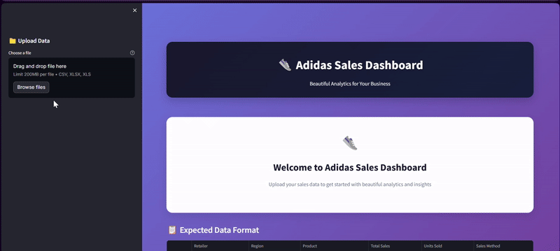

# 👟 Adidas Sales Dashboard

A beautiful, interactive web dashboard for analyzing Adidas sales data built with Streamlit and Plotly. Transform your sales data into actionable insights with modern visualizations and real-time analytics.

  



## ✨ Features

- **📊 Interactive Analytics**: Real-time KPIs including revenue, units sold, transactions, and profit margins
- **🎨 Beautiful UI**: Modern gradient design with responsive layouts and smooth animations
- **📈 Dynamic Charts**: Revenue trends, regional performance, product analysis, and sales channel distribution
- **🎯 Smart Filters**: Multi-select filters for regions, sales methods, date ranges, and more
- **📱 Mobile Responsive**: Works seamlessly across desktop, tablet, and mobile devices
- **💾 Data Export**: Download filtered data as CSV or generate comprehensive reports
- **🚀 Fast Performance**: Optimized data processing with caching for quick insights

## 🚀 Quick Start

### Prerequisites
```bash
Python 3.8+
pip (Python package manager)
```

### Installation

1. **Clone the repository**
```bash
git clone https://github.com/yourusername/adidas-sales-dashboard.git
cd adidas-sales-dashboard
```

2. **Install dependencies**
```bash
pip install streamlit pandas plotly numpy openpyxl
```

3. **Run the application**
```bash
streamlit run dashboard.py
```

4. **Open in browser**
Navigate to `http://localhost:8501` in your web browser

## 📊 Data Format

The dashboard expects CSV or Excel files with the following columns:

| Column | Description | Example |
|--------|-------------|---------|
| Retailer | Store name | West Gear |
| Region | Geographic region | West |
| Product | Product name | Men's Footwear |
| Total Sales | Revenue amount | 600000 |
| Units Sold | Quantity sold | 1200 |
| Sales Method | Channel used | In-store |
| Invoice Date | Transaction date | 2020-01-01 |
| Operating Margin | Profit margin % | 50 |

## 🎯 Usage

1. **Upload Data**: Click "Choose a file" in the sidebar and select your CSV/Excel file
2. **Apply Filters**: Use sidebar filters to narrow down your analysis
3. **Explore Insights**: View interactive charts and key metrics
4. **Export Results**: Download filtered data or generate summary reports

## 📈 Dashboard Sections

### Key Metrics
- Total Revenue with trend indicators
- Units Sold across all channels
- Transaction count and frequency
- Average Operating Margin

### Visualizations
- **Regional Performance**: Horizontal bar chart showing revenue by region
- **Sales Channel Mix**: Pie chart displaying sales method distribution
- **Top Products**: Bar chart of highest revenue-generating products
- **Monthly Trends**: Line chart showing sales patterns over time

## 🛠️ Technology Stack

- **Frontend**: Streamlit with custom CSS styling
- **Data Processing**: Pandas for data manipulation and cleaning
- **Visualizations**: Plotly for interactive charts and graphs
- **Export**: Built-in CSV and report generation

## 📁 Project Structure

```
adidas-sales-dashboard/
├── dashboard.py          # Main application file
├── requirements.txt      # Python dependencies
├── README.md            # Project documentation
└── sample_data/         # Sample data files
    └── sample_data.csv
```

## 🤝 Contributing

1. Fork the repository
2. Create a feature branch (`git checkout -b feature/AmazingFeature`)
3. Commit changes (`git commit -m 'Add AmazingFeature'`)
4. Push to branch (`git push origin feature/AmazingFeature`)
5. Open a Pull Request

## 📄 License

This project is licensed under the MIT License - see the [LICENSE](LICENSE) file for details.

## 🆘 Support

- **Issues**: Report bugs or request features via [GitHub Issues](https://github.com/yourusername/adidas-sales-dashboard/issues)
- **Documentation**: Check the wiki for detailed guides
- **Community**: Join discussions in the repository

## 🔮 Roadmap

- [ ] Real-time data sync capabilities
- [ ] Advanced forecasting models
- [ ] Custom dashboard themes
- [ ] API integration for automated data updates
- [ ] Multi-user authentication system

---

Made with ❤️ by Junaid khan | ⭐ Star this repo if you find it helpful!
